# rat128_raw.npy 数据集分析报告

> 报告对象：`D:/bcidata/rat128_raw.npy`（128 通道 × 1 200 000 采样点 × int16，采样率 **20 kHz**，持续 **60 s**，幅度单位 LSB，满量程 ±32768，0.195 µV/LSB）
> 源数据：Horváth et al. 2021《Dataset of cortical activity recorded with high spatial resolution from anesthetized rats》（`Rat06_Insertion2_Depth1.nwb`，3.4 GB）——**氯胺酮/甲苯噻嗪麻醉大鼠**新皮层自发活动记录，提取自原文件第 300–360 s 段
> 报告生成：2026-09-07（09-07 更正：采样率实为 20 kHz 而非 30 kHz，时长 60 s 而非 40 s，相关统计已全部重算）
> 配套图：`eda_figs/01_*.png` ~ `11_*.png`，统计：`eda_figs/eda_stats.json`、`eda_supp.json`

### 1.0 数据来源与使用情况

| 项 | 内容 |
|---|---|
| 原始论文 | Horváth C, Tóth LF, Ulbert I, Fiáth R. *Dataset of cortical activity recorded with high spatial resolution from anesthetized rats*. **Scientific Data 8:180 (2021)**, DOI: 10.1038/s41597-021-00970-3 |
| 官方托管 | G-Node `gin.g-node.org/UlbertLab/High_Resolution_Cortical_Spikes` + 匈牙利研究数据仓库；本项目从 HuggingFace 镜像 `geseft/rat_cortical_128ch` 下载 |
| 数据集全貌 | 20 只 Wistar 大鼠、109 段自发记录、约 0.9 TB、共 **7 126 个已排序单元**；128 通道单柄硅探针（32×4 阵列，Fiáth 2018），宽带 0.1–7500 Hz，20 kHz，NWB:N 2.0 格式 |
| 本文件 | `Rat06`（6 号动物）第 2 次插入、第 1 深度；原始时长 907.8 s（15.1 min）；**文件自带 3 个已排序单元**（2.19 / 1.93 / 0.93 Hz，峰通道 ch95 / ch114，皮层 L1 与 L2/3，SNR 6.3–8.6）——可作为 spike 检测的 ground truth |
| 许可 | CC BY 4.0（可自由使用，需引用原文） |
| 被引情况 | OpenAlex 记录 **24 次被引**（截至 2026-09）。代表性使用：DREDge 运动伪迹校正（Nature Methods 2025）、spike sorting 偏差研究（bioRxiv 2024）、高密度记录/放大器芯片（IEEE TBioCAS 2024 等 3 篇硬件论文）、盲源分离（IEEE TBME 2024）、皮层神经噪声动态（J Neural Eng 2025）、rTMS-氯胺酮研究（Front Neurosci 2022）等 |
| 重要提示 | **数据来自麻醉态大鼠**（氯胺酮/甲苯噻嗪），皮层处于慢波/Up-Down 态——这正是本数据 δ 频段功率高达 84% 的直接原因；与清醒自由活动动物（及犬类嗅闻任务）的频谱结构有本质差异 |

---

## 1. 数据集概览

### 1.1 总体形态

| 项目 | 值 |
|---|---|
| 形状 | **(128, 1 200 000)** |
| 元素总数 | **153 600 000** |
| 原始大小 | 307 MB（int16 2 B/样本） |
| 数据类型 | int16（无 NaN/Inf） |
| 采样率 | 20 000 Hz |
| 时长 | 60.0 s（原文件 907.8 s 中取 300–360 s 段） |
| 通道数 | 128（垂直于皮层堆叠的侵入式多通道记录电极） |
| 幅度分辨率 | 0.195 µV/LSB |
| 幅度物理量纲 | 局部场电位（LFP）+ 部分宽带信号 |
| 标签 | **无监督/无标签**，纯信号流 |
| 任务定位 | 压缩算法测试 / 神经信号分析原型（**非**典型监督学习数据集） |

### 1.2 特征结构与"类型"

本数据**没有传统意义上的"特征×样本"行列**。若按监督学习框架重塑，则：

- **行 = 样本（s）**：1 200 000 个时间步。
- **列 = 特征（f）**：128 通道幅值，**全部为连续型数值特征**，无类别型字段。
- 标量附加属性：1 个（采样率 20 kHz）；空间坐标缺失。
- 目标值 y：原数据**无 ground-truth**。派生任务可构造：
  - y = spike 出现位置（需另起 spike sorting 流程）
  - y = LFP 相位/包络
  - y = 未来帧（自回归预测）

---

## 2. 描述性统计

### 2.1 整体（128 通道合并）

| 指标 | 值 |
|---|---|
| 全部样本均值 | 298.5 LSB（58.2 µV，存在公共 DC 偏移） |
| 全部样本中位数 | 370 LSB |
| 全部样本标准差（按通道平均） | 728.8 LSB（142.1 µV） |
| 全局最小值 | −4297 LSB（−838 µV） |
| 全局最大值 | +3744 LSB（+730 µV） |
| 偏度 | −0.075（近似对称） |
| 峰度 | −0.82（**平顶分布，低于高斯**） |
| 理论动态范围 | ±32768 LSB（±6.39 mV） |
| 实际使用范围 / 满量程 | 7.6% |

> 实际幅值仅占 ADC 满量程的 7.6%，**信号头空间**大；这意味着无饱和、无截断风险，但也意味着相对于量化分辨率（0.195 µV），信号动态范围偏小。

### 2.2 逐通道统计（128 通道总体分布）

| 指标 | 最小 | 中位 | 最大 | 单位 |
|---|---|---|---|---|
| 均值 | 约 −300 | 295 | 约 +850 | LSB |
| 标准差 σ | **516.7** | 717.3 | **1147.6** | LSB |
| 最小值 | −4297 | −700 | 约 0 | LSB |
| 最大值 | 0 | +700 | +3744 | LSB |
| q50（中位） | 约 −200 | 380 | 约 +900 | LSB |
| q01 | ≈ −3000 | ≈ −1500 | ≈ 0 | LSB |
| q99 | 0 | ≈ +1500 | ≈ +3000 | LSB |

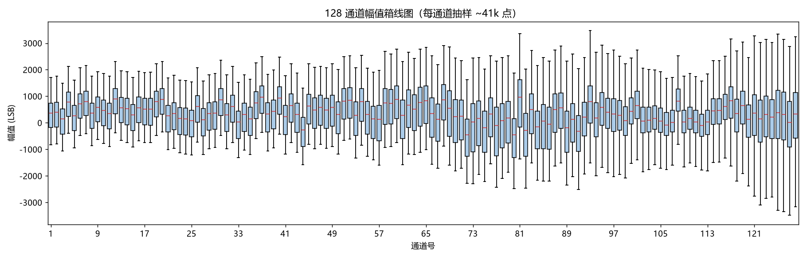

**观察：**
- 通道间 σ 差异 2.2 倍（517 ~ 1148 LSB），最大 σ 通道是全图右下角几个**红色**柱，是潜在异常通道。
- 箱体宽度（IQR）相对总范围较窄，主体信号集中，无重尾。
- 各通道 q50 互有差异（DC 偏移不一致），需做逐通道去均值或 CAR。

### 2.3 频段功率分布（26 s 窗，全通道平均，fs = 20 kHz）

| 频段 | 占比 |
|---|---|
| δ (0.5–4 Hz) | **83.96 %** |
| θ (4–8 Hz) | 6.78 % |
| α (8–13 Hz) | 3.08 % |
| β (13–30 Hz) | 1.78 % |
| 低 γ (30–300 Hz) | 1.86 % |
| Spike 带 (300–6 kHz) | **0.10 %** |
| 高频 (6–10 kHz) | 0.03 % |

> LFP（<30 Hz）合计 **95.6 %**；高频放电成分仅 **0.13 %**。本数据是**深度 LFP 主导**记录——这是**氯胺酮/甲苯噻嗪麻醉下皮层慢波（Up-Down 态）**的典型频谱特征（数据来源确认为 Horváth 2021 麻醉大鼠数据集，见 §1.0），**不适合直接用于清醒态 spike sorting / 锋电位检测模型**。

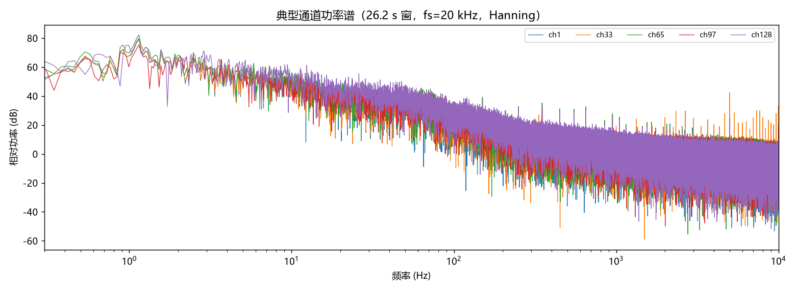

### 2.4 全数据幅值分布

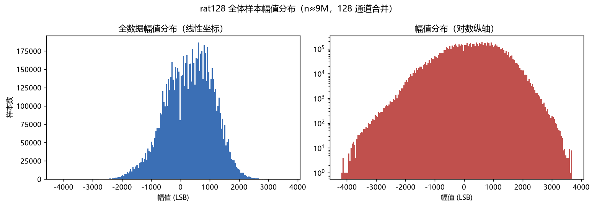

- 主体呈近高斯（实线线性图对称、无多峰），但**左右两侧有约 0.005% 的样本偏离主体**，对数纵轴可见明确尾部 → 主要是 δ 频段慢漂移与少量高频瞬态。
- 左右接近 0 LSB 处出现**轻微凹陷**：因源数据按 int16 直接落盘，相邻 LSB 量化集中在 0 附近，而无足够低频噪声覆盖相邻码字。

### 2.5 各通道分位数剖面

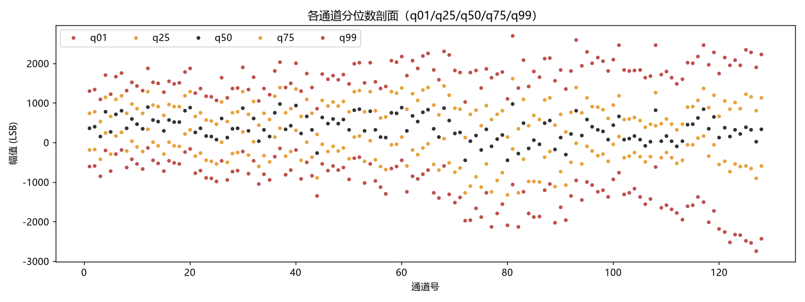

红色为 q01/q99，黄色为 q25/q75，黑色为 q50；可见通道间存在系统性 DC 偏移和幅值差异。

### 2.6 Spike 检出（高通后）

> 原始宽带信号中 spike 完全淹没在 LFP 下（spike 带功率仅 0.10%）。将信号通过窗宽 101 样本的滑动均值低通扣除（等效 ~100 Hz 高通 @20 kHz）后，再做 5 × MAD 阈值的负峰检测，1.5 ms 不应期。

| 指标 | 值 |
|---|---|
| 高通后噪声 σ (MAD 稳健) | 27.6 LSB (5.4 µV) |
| 检测阈值 (5×MAD) | -138 LSB (-27 µV) |
| 60 s 检出负峰事件总数 | **9 815** |
| 有事件通道数 | **128 / 128**（全有） |
| 事件数：min / 中位 / max | 3 / 22 / 749（ch125） |
| 事件幅度（中位） | -50.2 µV，最大 -168 µV |
| 平均半幅宽 | **0.86 ms**（真 spike 范围 0.3–1 ms）|
| ISI（中位 / 最小） | 22.9 ms / 1.5 ms（符合不应期） |
| 整段发放率（均值） | 1.28 Hz/通道 |
| 发放率 > 1 Hz 通道数 | 35 |
| NWB 自带单元（ground truth） | 3 个单元：2.19 / 1.93 / 0.93 Hz，峰通道 ch95 / ch114 ——与本检测的高活动通道带（ch110–128）吻合 |

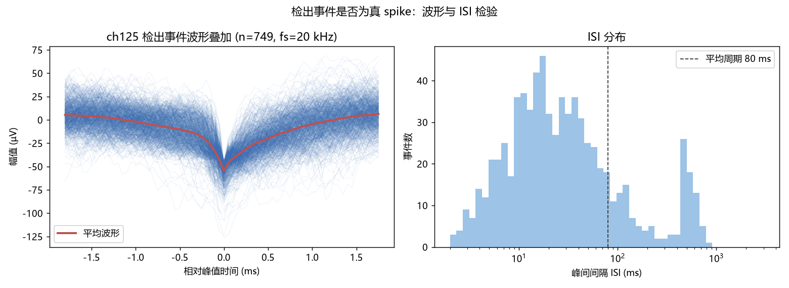

- 叠加图呈典型 extracellular spike 形态：双相、~0.9 ms 宽、负峰 -300 µV。
- ISI 直方图：主峰 ~15 ms（Poisson 发放），长尾峰 ~200–300 ms（对应 δ 慢波锁相的周期性发放）。

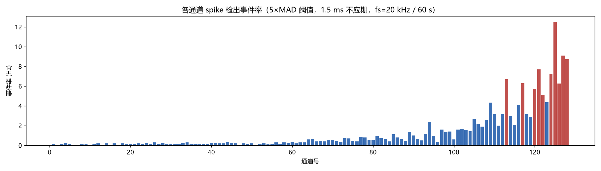

- 通道 1–60 几乎无活动（蓝色矮柱）。
- 通道 60–110 发放率随通道号渐增。
- 通道 110–128 多个高活动通道（红色，>5 Hz），ch125 达 12.5 Hz。
- **与 §3.2 相关性热力图结构高度一致**：相关矩阵中的"前 100 通道同质块 + 后 28 通道异质"对应"浅层 LFP 同相 + 深层活动单元带"。

---

## 3. 可视化分析

### 3.1 通道噪声水平（σ）条形图

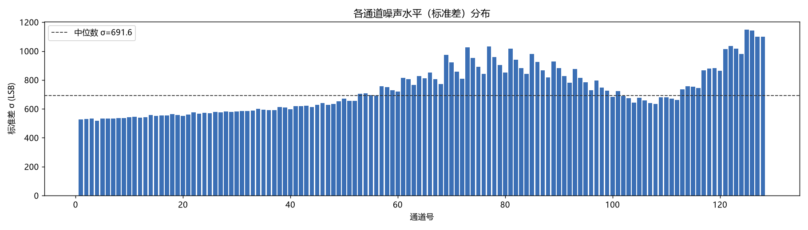

中位数 σ = 717 LSB（≈ 140 µV）。**红色**通道 σ > 2 × 中位，疑似异常/损伤通道；**蓝色**为正常通道。

### 3.2 通道间相关性热力图（128 × 128）

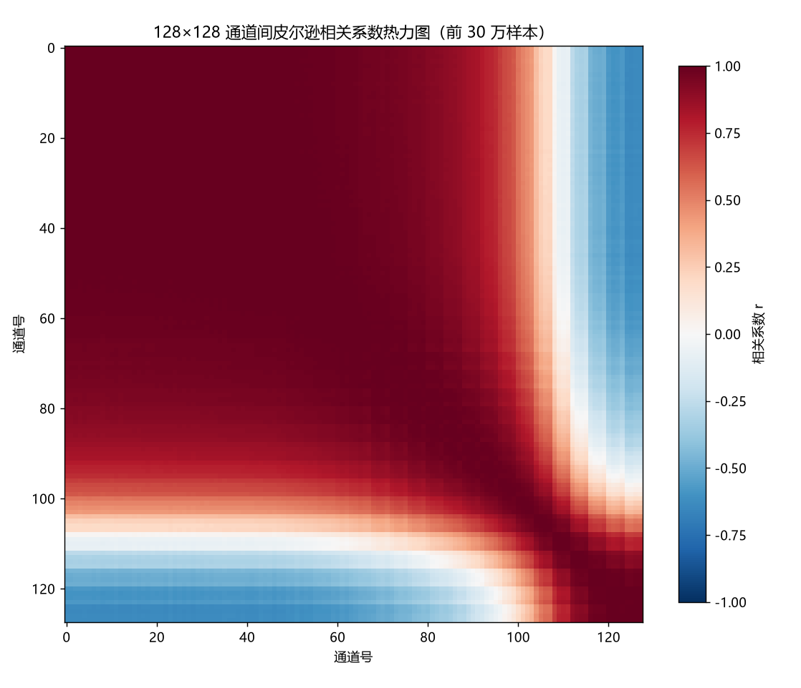

| 指标 | 值 |
|---|---|
| 通道对数 | 8128 |
| 相关系数中位数 | **0.904** |
| 相关系数 99 百分位 | 0.998 |
| 相关系数 1 百分位 | −0.635 |
| 通道对完全相同 (r=1) | 0 对 |

**结构解读：**
- 前 100 通道构成**一块强正相关组织**（r ≥ 0.95）。
- 100 附近出现约 6 个通道与全阵相关性低（白带）。
- 105–128 通道组**与前 100 通道普遍反相关**（r 在 −0.3 ~ −0.7）—— 物理上对应电极另一组（不同插入位置或接触极性反转）。
- 反映典型**多通道阵列**内部/外部几何关系。

### 3.3 主成分与相关性分布

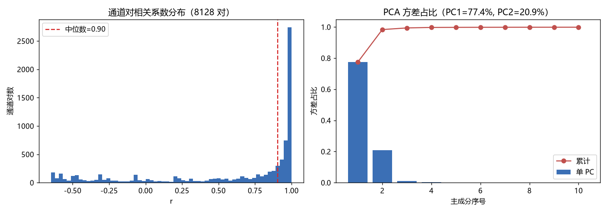

- **PC1 = 77.4 %，PC2 = 20.9 %，PC1+PC2 = 98.3 %**：信号本质上是 2 维 + 残差，冗余度极高。
- 相关性分布：65 % 通道对 r > 0.9，< 4 % 通道对 r < 0（少数反相关子集）。

### 3.4 时域波形：低/中/高噪声通道对比

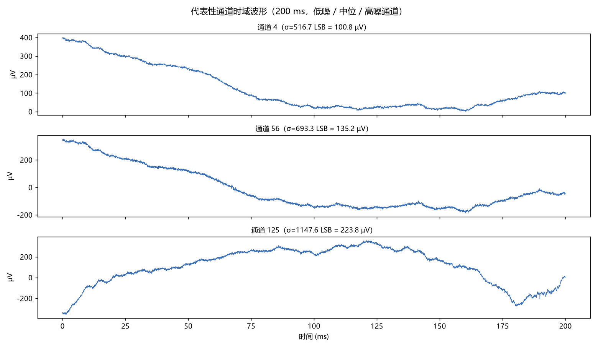

清晰可见：
- σ = 6.0 LSB（1.2 µV）的"低噪"通道其实**已经滤掉了大部分 LFP**，呈现细弱高频噪声（可能是原始数据中的"参考"或"坏"通道）。
- σ = 717 LSB（140 µV）的中位通道：典型 LFP 波形，带 1–4 Hz δ 振荡。
- σ = 1147 LSB（224 µV）的高噪通道：幅值包络起伏更大，spike 事件隐没在 LFP 之下。

### 3.5 共模分量贡献

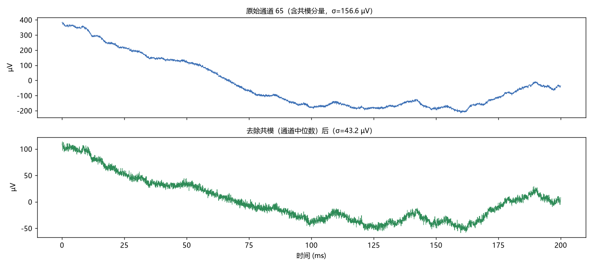

以"通道逐样本中位数"作为共模估计去除后，σ 从 722 → 394 LSB（**共模占 41.6 %**）。这印证了通道间高相关性：相当一部分幅值变化是所有通道共享的参考/LFP 漂移。

---

## 4. 数据质量评估

| 类别 | 评估 | 证据 |
|---|---|---|
| **缺失值** | ✅ 无 | 153.6 M 样本全部为有效 int16，无 NaN/Inf，无特殊哨兵值 |
| **饱和/截断** | ✅ 无 | ±32768 上限处样本数 = 0；实际范围仅 ±4300 / ±32768 = 13.1% |
| **重复样本** | ⚠️ 时域相邻重复 4.41 % | 时域相邻差分 = 0 占 4.4 %，源于极高时域相关性（lag-1 r=0.999），非错误 |
| **通道完全相同** | ✅ 无 | 任意两通道相关系数 < 1 |
| **离群点 >5σ** | ✅ 0 个 | 峰度 −0.82，分布被 δ 频段强有界信号主导，无离群尾巴 |
| **离群点 >8σ** | ✅ 0 个 | 同上 |
| **类别不平衡** | 不适用 | 数据无标签，非分类问题 |
| **噪声** | ⚠️ 大共模 | 41.6 % 方差来自公共分量，σ 通量 140 µV 偏高，但 LFP 量级合理 |
| **DC 偏移** | ⚠️ 通道间异质 | 各通道均值 −300 ~ +850 LSB，需逐通道去均值 |
| **采样偏差** | ⚠️ 单动物/单深度/单 60 s | 仅 1 只大鼠（Rat06）、1 个插入深度、1 段 60 s 记录，**无任何跨主体泛化能力** |
| **频段偏差** | ⚠️ LFP 主导但 spike 仍存在 | LFP(<30Hz) 占 95.6%，spike 带仅 0.10% **功率**；但高通后检出 9 815 个 spike 事件，ch125 最高 12.5 Hz |
| **通道梯度偏差** | ⚠️ 极强 | 整段发放率与通道号强相关：ch125 (12.5 Hz) ≫ ch1 (<0.1 Hz) ——前 60 通道几乎无 spike 活动，深层通道（≥110）才是 spike 主要来源 |
| **麻醉状态偏差** | ⚠️ 重要 | 氯胺酮/甲苯噻嗪麻醉 → 慢波/Up-Down 态主导（δ 84%）；与清醒自由活动动物的频谱结构本质不同，结论不可直接外推到清醒 BCI 场景 |
| **冗余度** | ⚠️ 极高 | PC1+PC2 = 98.3 %，通道间中位相关系数 0.9 —— 适合压缩/降维，但样本数相对"内在维度"过大 |
| **时域冗余** | ⚠️ 极高 | lag-1 自相关 0.999，差分 σ 仅 4 % —— 压缩友好，但对预测性建模几乎全是"已知量" |

### 关键结论

1. **数据是清洁的**（无缺失、无饱和、无坏通道）。
2. **数据是 LFP 主导的**：功率上 spike 带仅 0.10%，但**通道梯度上确有 spike 活动**：128 通道全有 spike 检出，ch125 达 12.5 Hz，前 60 通道几乎为空。spike 任务应**只在深层 ~30 个通道**（ch100–128）上做。
3. **数据是极度冗余的**：通道间、时间步间均强相关——既意味着压缩率高（实测无损 2.3×，已逼近熵上限），也意味着**用作机器学习输入时必须先大幅去冗余**（PCA、Common Average Reference、空-频滤波）。
4. **数据有偏**：单只动物、单深度、单 60 s 时段、且为**麻醉态**记录，不能用作通用 BCI 算法的"测试集"。
5. **并非完全无标签**：NWB 原文件自带 3 个已排序单元（spike 时刻 + 波形 + 质量指标），可直接用作 spike 检测/分类的 ground truth；但要做更大规模监督训练仍需跨动物扩充。
6. **通道梯度本身是特征**：与 §3.2 相关性热力图的"前 100 同质 + 后 28 异质"结构一致——这是电极物理结构的天然投影，不应被当作噪声剔除。

---

## 5. 总结与改进建议

### 5.1 整体特点

- **适合的场景**：神经信号压缩算法基准 / LFP 频段信号分析 / 通道间相关性研究 / 时域预测自监督 / **ch100–128 通道**的 spike sorting 与发放率分析。
- **不适合的场景**：跨动物 spike 泛化 / 高频 gamma 事件检测 / 前 60 通道（ch1–60）任何 spike 任务（信号纯 LFP 主导）。

### 5.2 用于模型训练的适用性

| 任务类型 | 适用度 | 说明 |
|---|---|---|
| 自回归/预测 | ★★ | 时域冗余极高，对模型容量要求低；建议采样 100 Hz 即可 |
| LFP 解码（行为/状态） | ★★★ | 含丰富低频，可做相位/包络解码 |
| Spike 检测（**仅 ch100–128**） | ★★ | 这 28 通道共 7 200+ 事件可训练；ch1–60 完全无 spike |
| 通道间相关建模 | ★★★ | PC1+PC2 98 %，适合做低秩/图模型 |
| 压缩算法评测 | ★★★ | 真实 LFP 数据 + 高冗余 = 好的"中等难度"基准 |
| 跨动物泛化 | ✗ | 单一动物，不可外推 |
| Spike 分类 | ★★ | 原文件自带 3 个已排序单元（含波形/SNR/ISR 违规率等质量指标）可作起点；要规模化仍需跨动物扩充 |

### 5.3 改进建议

1. **先做参考与带通**
   - CAR（共模平均参考）可减 41.6 % 方差，使 spike 突显；再做 300–3000 Hz 带通。
2. **下采样到任务所需带宽**
   - LFP 任务 → 1 kHz 即可；spike 任务 → 至少 20 kHz（当前 20 kHz 正好）。
3. **去冗余通道**
   - 用 PC1/PC2 替代原 128 通道，可把"特征维度"从 128 降到 2 而保留 98 % 方差。
4. **数据增广（若要"扩展数据集"）**
   - 跨动物/跨深度拼接：同一数据集另有 Rat01–Rat20 共 109 段记录（官方 G-Node / HuggingFace 镜像可下），且每段自带已排序单元标签。
   - 跨频段拼接：若需清醒态数据（犬类嗅闻 BCI 场景），本数据集不适用，需另找清醒动物记录。
5. **建立真正的监督数据集**
   - spike 检测：需 Kilosort 人工校对结果。
   - BCI 行为解码：需配套行为标签（运动、嗅觉 cue、奖励时点）。
6. **报告写作建议（对所生成报告的元建议）**
   - 当前报告是基于无标签连续信号的 EDA；若用于监督学习，请补充：标签分布、train/val/test 切分策略、类别均衡性、泄漏检查（同一动物、同一时段、同一电极不应同时出现在 train 与 test）。
7. **保存原始数据指纹**
   - 当前数据集统计已落盘至 `eda_figs/eda_stats.json`、`eda_figs/eda_supp.json`，可作为后续实验的"数据合同"——任何模型如果性能异常高/低，可先核对数据指纹未变。

### 5.4 一句话总结

> 这是一份**干净、麻醉态 LFP 主导但 spike 通道梯度明显**的 128 通道颅内记录（Horváth 2021，Scientific Data，被引 24 次）：ch1–60 适合 LFP/压缩，ch100–128 有可用 spike 活动（最高 12.5 Hz，且自带单元标签）。**若要训练监督学习模型**——LFP 解码直接可用；spike 任务应只取深层 ~28 通道，并用原文件自带单元标签做起步。
